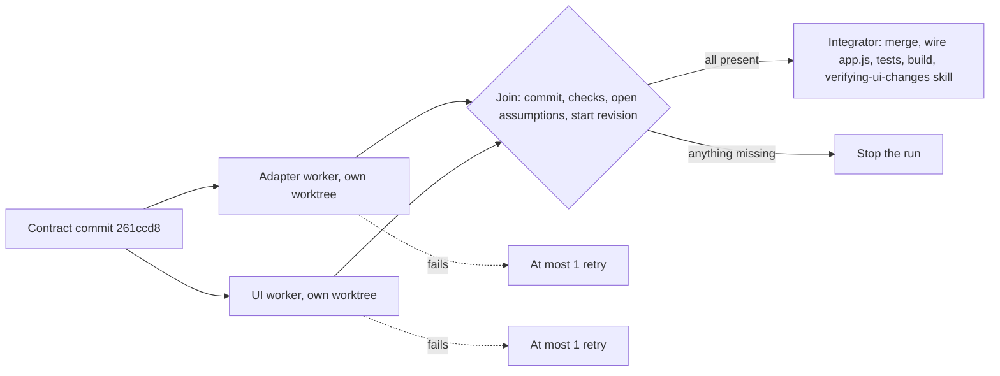

## Setup
- **Worker isolation:** Considering the current state of the project, and the resources shared that pointed to the docs, the following was done before starting the workflow:
    - `worktree.baseRef: "head"` in `.claude/settings.local.json`, so worker worktrees start from the current commit instead of `master`. 
    - `.worktreeinclude` copies `.env` and `.env.development.local` into the worktrees.
    - `.claude/worktrees/` and `.worktreeinclude` excluded from git locally.

## Graph
Defined by me before the workflow, and given to it as its prompt.

- **Dependencies:** Both workers depend only on the shared data contract, so they run in parallel and the integrator waits for both. Each worker has its own worktree and starts no dev servers, so they can't interfere with each other.
- **Worker contracts:** Start from `261ccd8` or stop. The adapter may only add files in `src/wallet/` and the UI may only change the header and footer, their styles and tests. The join in the workflow script checks them.
- **Limits:** At most 2 workers and 1 retry per failed worker, both built into the workflow script.

## Runs
### Shared data contract: header, footer and wallet
- **Task and start commit:** Define the shared data contract for the header, footer and wallet redesign, so that an adapter worker and a UI worker can implement it in parallel. Commit [344a90d](https://github.com/kleros/dispute-resolver/commit/344a90d5b5b96157d75cefd709e63ff4607ce303)
- **Done when:** The contract covers every state the header and footer must show/handle, and is committed before the workflow starts.
- **Configuration:** Claude Code, Fable 5.1, high.
- **Cost and time:** 5 minutes total, 1 minute mine. $2.08 API equivalent cost.
- **Result and evidence:** `src/wallet/walletStatus.js` at [261ccd8](https://github.com/kleros/dispute-resolver/commit/261ccd8), with example values for every state. It needed one follow-up to add a Gnosis example, since fixture mode runs there.

### Workflow run: header, footer and wallet
- **Task and start commit:** Implement the graph above with `/effort ultracode`. Commit [261ccd8](https://github.com/kleros/dispute-resolver/commit/261ccd8).
- **Done when:** Both workers return their delivery notes, the join passes, and the integrator's tests, build and skill evidence pass.
- **Configuration:** Claude Code CLI, Fable 5.1, `/effort ultracode`, auto mode. `/effort high` afterwards to exit.
- **Cost and time:** 2h15 total, 30 minutes mine. $64.06 API equivalent cost.
- **Start revision:** Each worker checked `git rev-parse HEAD` against `261ccd8` as its first step and would stop otherwise.
- **Pause:** Pausing stopped both running workers. Resuming relaunched the run from its saved state, and both workers restarted from scratch because neither had completed.
- **Forced failure:** Stopped the adapter, which started first. The UI worker completed with a full delivery note, but the join rejected it because `yarn install` errored out with a pre-existing error I forgot. Per the graph, a retry worker was launched, which I stopped.
- **Recovery:** Asked the session to relax the install rule and relaunched. The failed adapter reran, and so did the completed UI worker, because it had started after the adapter. This was in accordance with the docs. However, the relaunch reused the previous run's worktrees, and because the UI worker's had already committed before, the start revision failed. Its one allowed retry worked though, because it reset the work tree to the right commit and did the job instead of stopping. Later, the join rejected it, because the retry honestly reported what it had done. I had the session change the join to check the commits themselves, both for the parent being `261ccd8` and the changes only in allowed files, and resume. Both workers came back from cache, and the integrator ran.
- **Independent task:** The effort comparison task below ran in Codex during the workflow, with a return note in `next.md`.
- **Saved:** Saved the script and moved it to `~/.claude/workflows/` to keep it out of the repo.
- **Result and evidence:** Committed at [dbead55](https://github.com/kleros/dispute-resolver/commit/dbead55). Build and tests, including new ones, passing. The integrator also deleted one piece of unused code. The `verifying-ui-changes` skill ran in the CLI without a browser, so its visual, width and wallet rows were not checked, and it reported it. My browser pass found minor UI nits and one problem with loading data when switching chains via the connected wallet, all fixed in a quick separate session to avoid unnecessary context. Cost and time for these fixes was negligible, merged at [a0a9418](https://github.com/kleros/dispute-resolver/commit/a0a9418952121415f6d3baa11c594445cc86c928). Updated header [with wallet](/evidence/day-4/header-connected.png) and [without](/evidence/day-4/header-not-connected.png). [Updated footer](/evidence/day-4/footer.png).
- **Learnings/Notes:** 
  - The most important learnings were that my join was too strict about a pre-existing install failure, which cost me a retry. The start-revision check was the most useful rule, as it caught Claude Code reusing stale worktrees on relaunch. A worker worked around its own stop rule, and only the join enforced it. Cache replay followed the docs.
  - Most recently, I have been using the Claude Desktop App, as it has improved massively, and it makes it easier to follow what is being checked (e.g actually watching the browser as the agent navigates). As a quick experiment, I tried to run the workflow using it, and the result was obvious: the CLI allows managing workflows far better than Desktop. A few findings:
    - Desktop doesn't even have all the options, particularly for managing individual workers. It expects the workflow to be managed via chat.
    - The only downside of the CLI that I can think of is the harder configuration required for browser access.
    - Also tried to manage the session via `/remote-control` and the UI matches the desktop app.

### Effort comparison: GPT-6 Astra medium vs extra-high
- **Task and start commit:** Two bounded tasks, same prompt, in separate copies, during the workflow run. Commit [261ccd8](https://github.com/kleros/dispute-resolver/commit/261ccd8) for the first task, the second task on top of the first one.
- **Done when:** Both efforts pass tests and build on each task. I keep the better version.
- **Configuration:** Codex, GPT-6 Astra, medium vs extra-high.
- **Cost and time:** 13 minutes total, 5 minutes mine. Weekly usage left moved from 90% to 88%.
- **Result and evidence:**
  - **Easier task:** Use the chain's currency instead of the hardcoded `ETH` label: 
      - Medium 1m31s, extra-high 2m20s. Same 4-line fix. Extra-high's test was slightly stronger, so kept it, but too trivial on its own to tell the efforts apart. Committed at [d4a4eca](https://github.com/kleros/dispute-resolver/commit/d4a4eca9370ae81e2b8fe61dbee67dbdbe6b02b9).
  - **Medium task:** Ongoing "Court unavailable" flash while loading:
      - Medium 2m31s, extra-high 3m04s. Both asked the same scope question. Medium solution was actually slightly better, including a better test, contrary to the previous task experience, so it was kept. Committed at [91a9751](https://github.com/kleros/dispute-resolver/commit/91a9751aa9382d1aded578b112e1aba80bfee741).
- **Learnings/Notes:** On both tasks the lower effort was faster and at least as good. Maximum effort didn't win. This is not enough to make a generalization though, as the tasks were not very complex, although one was slightly harder.

### Two workstreams: A) evidence form and B) fresh install
- **Task and start commit:** Two independent tasks in parallel, each with a brief and acceptance checks. Commit [a0a9418](https://github.com/kleros/dispute-resolver/commit/a0a9418952121415f6d3baa11c594445cc86c928).
- **Done when:** Both tasks pass their acceptance checks, and changes accepted by me are integrated.
- **Configuration:**
  - A: Claude Code, Fable 5.1, high. 
  - B: Codex, GPT-6 Astra, high.
- **Cost and time:** 
  - A: 30 total minutes, 5 minutes mine. $10.37 API equivalent cost.
  - B: 10 total minutes, 5 minutes mine. Weekly usage unchanged.
- **Task list:**

| Task | Owner | State | Next action | Evidence |
| --- | --- | --- | --- | --- |
| A: evidence form restyle | Claude Code | Integrated | None | [bc66f32](https://github.com/kleros/dispute-resolver/commit/bc66f32c2cbbe378e7326545d33fe25c27b301e3) |
| B: fresh install on Node 23 | Codex | Integrated | None | [05d6457](https://github.com/kleros/dispute-resolver/commit/05d6457f4a74c79863ae833dffaf06895ace5084) |

- **Overlap:** A ran between 2.45PM – 3.10PM. B ran between 2.47PM and 2.52PM. Both overlapped for about 5 minutes.
- **Review and rework:** A required a small follow-up for UI taste. B required none.
- **Result and evidence:** Both accepted, integrated, and sessions closed. Commits are in the table.
- **Learnings/Notes:** Parallel work did help, particularly because these were two unrelated tasks in the same project. It was easy to manage these two sessions, but I was also expecting B to take much more time. I have already experimented with parallel work, but the "async check-ins" tip on R27 is something I'll be adopting. It is of course dependent on task complexity, but I can comfortably supervise at least two parallel workstreams. For multiple tasks that are not complex, I have tried up to 5. Of course I am the bottleneck in these cases, but I also feel my review quality diminishing because I tend to try to do it faster, so agents are not idle because of me. So, my current final number is between 2 and 4, depending on task complexity. I feel like with some of the tips on the resources, and also with workflows that have an integrator with the proper rules, I can improve this.

### Workflow saved and provenance
- **Saved workflow:** `~/.claude/workflows/`, outside the repo.
- **Provenance:** Git shows me as the author of every commit. The workflow's commits also name Claude as co-author, but not which agent made them, so this log is the full record:
  
| Commit | Claude Code | Codex |
| --- | --- | --- |
| [261ccd8](https://github.com/kleros/dispute-resolver/commit/261ccd8) | Contract session | |
| [95a1fcd](https://github.com/kleros/dispute-resolver/commit/95a1fcd) | Workflow adapter worker | |
| [402ac66](https://github.com/kleros/dispute-resolver/commit/402ac66) | Workflow UI worker | |
| [c7fed45](https://github.com/kleros/dispute-resolver/commit/c7fed45), [a8037b2](https://github.com/kleros/dispute-resolver/commit/a8037b2), [dbead55](https://github.com/kleros/dispute-resolver/commit/dbead55) | Workflow integrator | |
| [d4a4eca](https://github.com/kleros/dispute-resolver/commit/d4a4eca) | | Codex, extra-high (effort comparison) |
| [91a9751](https://github.com/kleros/dispute-resolver/commit/91a9751) | | Codex, medium (effort comparison) |
| [a0a9418](https://github.com/kleros/dispute-resolver/commit/a0a9418) | Fix session | |
| [05d6457](https://github.com/kleros/dispute-resolver/commit/05d6457) | | Workstream B |
| [bc66f32](https://github.com/kleros/dispute-resolver/commit/bc66f32) | Workstream A | |

- **Broken link:** I had to re-sign the workflow run agent commits, which changed their hashes.